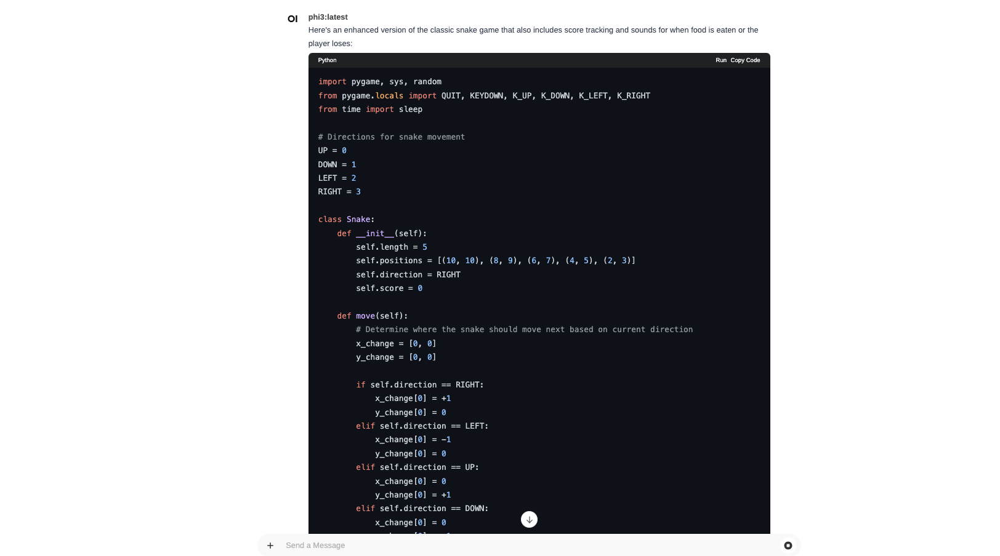

# Snake

## user prompt

Goal

Implement a snake game in python.
User should be able to use arrows to move with snake.
Snake should grow if eats point
Snake should die if move from screen
Snake should die if hit himself 

Create a game snake in python. Write a code, so I can copy paste it and run it.

### result
- GPT ✅ - working
- qwen ❌ - not abel to geenerate, still getting not complete result.
- Phi ❌ - not working due to indentation error and used "turtle" instead of "pygame"

## adjusted prompt

Goal

Implement a snake game in python.
User should be able to use arrows to move with snake.
Snake should grow if eats point
Snake should die if move from screen
Snake should die if hit himself 

Create a game snake in python. Write a code, so I can copy paste it and run it.

Make sure to:
- have correct indentations
- to not do any typos
- code is working

### result
Empasizes importance of indentation in python and to not include any typos. We expect phi to provide working code.

- GPT ✅ - working, had to adjust one "typo" error anyway
- llama ❌ - generated code with working "game window" however snake wasn't eating the food.
- Phi ❌ - code not working, and stopped at generating

