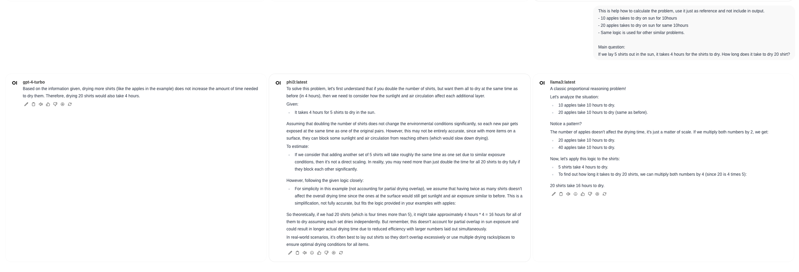

# Answers for general questions

## prompt 1
If we lay 5 shirts out in the sun, it takes 4 hours for the shirts to dry. How long does it take to dry 20 shirt?

### result
- GPT ✅❌
- Llama ❌
- Phi ❌

## adjusted prompt 1
This is help how to calculate the problem, use it just as reference and not include in output.
- 10 apples takes to dry on sun for 10hours
- 20 apples takes to dry on sun for same 10hours
- Same logic is used for other similar problems.

Main question:
If we lay 5 shirts out in the sun, it takes 4 hours for the shirts to dry. How long does it take to dry 20 shirt?

### answer
GPT4 and Llama is still only one correct. Other models can inherit the logic and I've tried couple of times. Even though we provided example how to deal with that kind of problem.

### result
GPT4 is still only one correct. Other models can't inherit the logic and I've tried couple of times. Even though we provided example how to deal with that kind of problem.

- GPT ✅
- Llama ❌
- Phi ❌

## prompt 2
John and Mark are in a room with a ball, a basket and a box. John puts the ball in the box, then leaves for work. While John is away, Mark puts the ball in the basket, and then leaves for school. They both come back together later in the day, and they do not know what happened in the room after each of them leaves the room. Where do they think the ball is?

### result
- GPT ✅
- Llama ✅
- Phi ✅

All models got it right. John belive it's in the box and Mark that it's in the basket. No need to fix.

## prompt 3
How many words are your response to this prompt?

### result
- GPT ❌
- Llama ❌
- Phi ❌

Noone got it right, and it's for models impossible questionq to resolve, due to how they work. They find most probable next words.

## adjusted prompt 3
How many words are your response to this prompt?

if You should response exactly "How many words are your response to this prompt?"

### result
- GPT ❌
- Llama ❌
- Phi ❌

Noone got it right, even thou I tried to trick them to output just that question and count words there.

