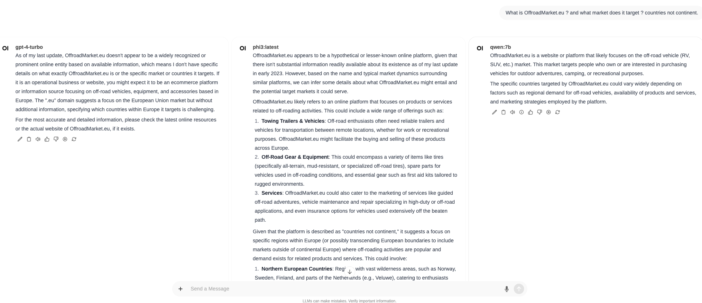
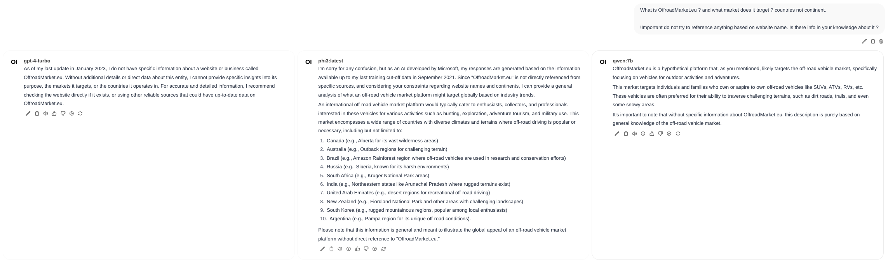

# Domain knowledge

## prompt
What is OffroadMarket.eu ? and what market does it target ? countries not continent.

## answer
It's my project. Released in 2023. LLMs probably shouldn't know about it.

### result
- GPT ✅ - do not know
- Qwen ✅ - do not know
- Phi ✅ - do not know

They just assume based on domain name and they are close cause name is self explanatory.

## adjusted prompt
What is OffroadMarket.eu ? and what market does it target ? countries not continent.

!Important do not try to reference anything based on website name. Is there info in your knowledge about it ?

## answer
Adjusted prompt to emphasize to do not infer info from website name and use just knowledge.

### result
- GPT ✅ -  says last data has Jan 2023
- Qwen ✅ - doesn't says about last data
- Phi ✅ - says last data has Sep. 2021

They just assume based on domain name

